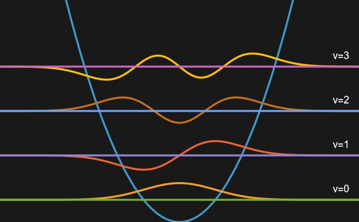

# The Harmonic Oscillator

The Harmonic Oscillator is the second quantum model we will see which can be solved exactlly. As a rationalization for creating this model, we can determine what is oscillating in a chemical system. The answer is bonds between atoms, so we can model vibrations of chemical bonds using the Harmonic Oscillator model!

## Harmonic Oscillator Wavefunctions

To make the quantum mechanical model, we need to solve the Schrödinger Equation. Recall the full form of the Schrödinger Equation:

$$\frac{-\hbar^{2}}{2m}\nabla^{2} \Psi (x) + V(x) \Psi (x) = E \Psi (x)$$

We have already sovled for the potential energy, so now we need to determine what our wavefunctions are. Utilizing the power series method for solving differential equations and the postulates of quantum mechanics, the eigenfunctions of this hamiltonian (wavefunctions) are given by:

$$\psi_{v}(x)=N_{v}H{v}(y)e^{\frac{-y^{2}}{2}}$$

Where $$v$$ is a new quantum number that can be any whole number (ie. 0,1,2,3,...), $$N_{v}$$ is a normalization constant given by $$N_{v}=(\alpha \sqrt{\pi}2^{v}v!)^{\frac{-1}{2}}$$ , $$y=\frac{x}{\alpha}$$, $$H_{v}$$ is the Hermite Polynomial for a give value of $$v$$, and, finally, $$\alpha=(\frac{\hbar^{2}}{mk_{f}})^{\frac{1}{4}}$$

Visualizing the first few Harmonic Oscillator Wavefunctions:

## Harmonic Oscillator Energy Levels

The quantized energy is given by:

$$\begin{align}
E_{v}&=h \nu (v + \frac{1}{2}) \\
&=\hbar \omega (v+\frac{1}{2})
\end{align}$$

Where $$\omega=\sqrt{\frac{k_{f}}{m}}$$

Here, we see that when the quantum number $$v$$ is equal to zero, the system still has energy; this is known as the zero-point energy and it is a stark contrast to the Particle in a Box quantized energy, wherein the quantum number $$n$$ could not be equal to zero. Additionally, we can see that the spacing between energy levels is constant, since as $$v$$ increases, $$E_{v}$$ will increase linearly. This is also different than the PIB energy, where there was a square dependence on the quantum number $$n$$ and the spacing between energy levels increased. 

---
