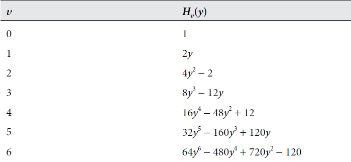

# Eigenfunction for a Quantum Harmonic Oscillator
In this section, we will state and discuss the solution of the wave function for the quantum harmonic oscillator. Afterward, we will prove that the solution's eigenvalue $$E$$ is consistent with the well-known and established energy values of the system, thereby proving the solutions' validity. We will begin by declaring Schrodinger's equation.

### Schrodinger Equation for a Quantum Harmonic Oscillator
Mentioned previously in the Harmonic Oscillator section [^1], Schrodinger's equation for a quantum harmonic oscillator is $$H\psi + V\psi= E\psi$$, where $$H=$$ $$\frac{-ℏ^2}{2m} ∇^2$$, $$V=$$ $$\frac{1}{2}kx^2$$, and $$\psi$$ is the particle's wave function. Note $$V$$ is the potential energy function of a harmonic oscillator.

Thus, with these definitions included, Schrodinger's equation is

$$\frac{-ℏ^2}{2m} ∇^2\psi + \frac{1}{2}kx^2\psi= E\psi$$

### Definition and Discussion of the Eigenfunction for Harmonic Oscillator

It has been determined that the energies permitted by the boundary conditions for Schrodinger's equation for an oscillator are $$E_v = (v + \frac{1}{2})ℏ\omega$$ [^1], where $$\omega=\sqrt{\frac{k_f}{m}}$$. We will later use this fact to prove that the precise solution to Schrodinger's Equation for a quantum harmonic oscillator is

$$\psi_v(y) = N_vH_v(y)e^\frac{-y^2}{2}$$

where $$y = \frac{x}{\alpha}$$, $$\alpha = (\frac{ℏ^2}{mk_f})^\frac{1}{4}$$, and $$N_v$$ is the normalization constant $$N_v =\frac{1}{\alpha\pi^\frac{1}{2}2^vv!}$$

There are several oddities in this solution that distinguish it from the previously discussed wave functions, specifically with the terms $$H_v$$ and $$e^\frac{-y^2}{2}.$$ The exact development of this model will not be discussed, but we can comment on the significance of these terms.
The term $$e^\frac{-y^2}{2}$$ represents the Gaussian curve, reflecting the probabilistic nature to the solution of the equation. Whereas $$H_v$$, known as the Hermite polynomials, are a sequence of polynomials with its expression depending on frequency $$v$$, shown in the table below: [^2]

For each $$v$$, the highest value exponent of $$y$$ at each level of $$H_v$$ is equal to frequency $$v$$. The order of $$H_v$$ determines the symmetry of the solution, which is valuable in charcaterizing the particle's properties. The image below displays the solutions to $$\psi_v(y) = N_vH_v(y)e^\frac{-y^2}{2}$$ with discretely increasing $$v$$. [^2]

Plotted along with the solutions is the potential energy curve (blue parabola). The wave functions corresponding to even $$v$$ are symmetric with respect to $$y=0$$ and those corresponding to odd $$v$$ are antisymmetric with respect to $$y=0$$. As x approaches 0, the Gaussian function approaches 1, and so $$H_v$$ dominates the behavior of the wave funtion. However, as x approaches infinity, the dampening effect of the Gaussian funtion dominates $$H_v$$, forcing the function to approach zero. 

### Proof of the Solution by Evaluating Eigenvalue E
To verify that the solutions are correct we will evaluate the solution at ground state ($$v=0$$). Afterwards, we can determine the eigenvalue $$E_0$$ and evaluate its consistency with the expected energy level for a quantum harmon oscillator $$E_v = (v + \frac{1}{2})ℏ\omega$$.

The solution at ground state, $$v=0$$, is

$$\psi_0(y) = N_0H_0(y)e^\frac{-y^2}{2}$$

Using the $$H_v$$ table above, we find that at $$v=0$$, $$H_0 = 1$$. We then substitute $$H_0 = 1$$ and the constant $$y = \frac{x}{\alpha}$$ into the solution to get

$$\psi_0(x) = N_0e^\frac{-x^2}{2\alpha^2}$$

To apply the solution to the Hamiltonian of Schrodinger's equation, we need the expression for $$\frac{d^2}{dx^2}\psi_0(x)$$. To obtain it, we must first compute $$\frac{d}{dx}\psi_0(x)$$ as follows:

$$\frac{d}{dx}\psi_0(x) = \frac{d}{dx}(N_0e^\frac{-x^2}{2\alpha^2}) = -N_0(\frac{x}{\alpha^2})e^\frac{-x^2}{2\alpha^2}$$

We then take the derivative of the above result by employing the product rule:

$$-\frac{d}{dx}N_0(\frac{x}{\alpha^2})e^\frac{-x^2}{2\alpha^2} = -[(\frac{d}{dx}N_0\frac{x}{\alpha^2})e^\frac{-x^2}{2\alpha^2} + N_0\frac{x}{\alpha^2}(\frac{d}{dx}e^\frac{-x^2}{2\alpha^2})]$$

Which evaluates to:

$$=-\frac{N_0}{\alpha^2}e^\frac{-x^2}{2\alpha^2} + N_0(\frac{x}{\alpha^2})^2e^\frac{-x^2}{2\alpha^2}$$

Upon substituting $$\psi_0$$ = $$N_0(x)e^\frac{-x^2}{2\alpha^2}$$, we arrive at the final result:

$$\frac{d^2}{dx^2}\psi_0(x) = \frac{x^2}{\alpha^4}\psi_0 - \frac{1}{\alpha^2}\psi_0$$

As the formula for $$\frac{d^2}{dx^2}\psi_0(x)$$ is now known, we can substitute it into Schrodinger's equation to obtain

$$\frac{-ℏ^2}{2m} (\frac{x^2}{\alpha^4}\psi_0 - \frac{1}{\alpha^2}\psi_0) + \frac{1}{2}kx^2\psi_0= E_0\psi_0$$

After substituting $$\alpha = (\frac{ℏ^2}{mk_f})^\frac{1}{4}$$ into the above expression and simplifying it, we receive

$$\frac{1}{2}\sqrt{\frac{k_f}{m}}ℏ\psi_0 = E_0\psi_0$$

And finally, substituting $$\omega=\sqrt{\frac{k_f}{m}}$$ provides us with our final result:

$$\frac{1}{2}ℏ\omega\psi_0 = E_0\psi_0$$

As we can see, the eigenvalue, $$E_0$$, is

$$E_0 = \frac{1}{2} \hslash \omega$$

This result is consistent with the permissable energy levels of a quantum harmonic oscillator, described by $$E_v = (v + \frac{1}{2})ℏ\omega$$. Thus, it follows that $$\psi_0$$, determined with the usage of hermite polynomials, is a solution to Schrodinger's equation for a harmonic oscillator.

---

[^1]: https://oreaganowombat.github.io/CH730-Fall25/Harmonic-Oscillator.html
[^2]: Atkins, P. W., De Paula, J., & Keeler, J. (2018). Atkins' Physical Chemistry (illustrated ed.), 7B.2: The Born interpretation (pg. 275-276). Oxford University Press.
