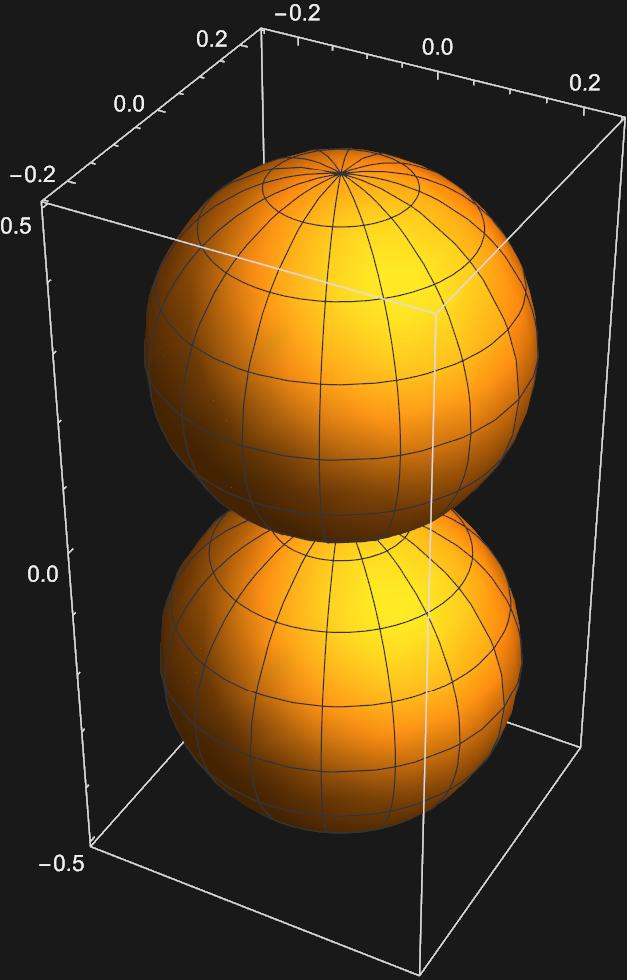

# Orbital Theory & Visualization in Mathematica
The Particle on a Sphere eigenfunctions, the spherical harmonics, can be used to construct the idea of atomic orbitals, which we are very familar with in chemical systems. Atomic orbitals are characterized by three quantum numbers which we have already seen, but can now examine in the context of orbitals. The first is the principle quantum number, $$n$$, which describes the location of an energy level (ie. which shell the orbital is). The second is the angular momentum quantum number, $$l$$, which describes the shape of the orbital. The last is the magnetic quantum number $$m_{l}$$, which describes the z-component of angular momentum. 
## Developing orbitals
In order to construct the shape orbitals we only need examine the last two of these quantum numbers, since $$n$$ will only change the relative size of the orbitals, but the shape will remain the same. \
Recalling from general chemistry, the values of $$l$$ tells us if we have an s, p, or d orbital, according to the table below.
|$$l$$|Orbital|
|---|---|
|0|s|
|1|p|
|2|d| 

Additionally, we know that $$m_{l}$$ can only occupy values from $$-l$$ to $$l$$. Adding this to our table:
|$$l$$|$$m_{l}$$|Orbital|
|---|---|---|
|0|0|s|
|1|-1,0,1|p|
|2|-2,-1,0,1,2|d| 

Upon first glance it may seem that the values of $$m_{l}$$ directly correspond to the different orentations of the orbitals in space (ie. the three possible $$m_{l}$$ values for the $$p$$ orbitals correspond to $$p_{x}$$,$$p_{y}$$, and $$p_{z}$$), but graphing the spherical harmonics for these values, yields a different result.

## Visualization of Spherical Harmonics in Mathematica
Graphing the Spherical Harmonics for $$l = 0$$ and $$m_{l} = 0$$ yields: 

 

This appears to be an s-orbital, as we expect from general chemistry. But it gets more interesting as we try to graph the 3 spherical harmonics for $$l=1$$ 

The second plot corresponding to $$m_{l}=0$$ apears to be a $$p_{z}$$ orbital, but the othe two look nothing like the $$p_{x}$$ or $$p_{y}$$ orbitals. In order to get these orbitals, we must take linear combinations of the $$Y_{1,-1}(\theta , \phi)$$ and $$Y_{1,1}(\theta , \phi)$$ spherical harmonics. Mathematically this looks like: \
$$\frac{1}{\sqrt{2}}(Y_{1,1}(\theta , \phi)+Y_{1,-1}(\theta , \phi))$$ \
and \
$$\frac{1}{\sqrt{2}}(Y_{1,1}(\theta , \phi)-Y_{1,-1}(\theta , \phi))$$ \
Graphing these two functions yields: 

Now we have representations for the $$p_{x}$$ and $$p_{y}$$ orbitals, respectively. \
We can perform a similar excercise to get the five d-orbitals we are familar with:
$$d_{z^{2}}:Y_{2,0}(\theta , \phi)$$

$$d_{xz}:\frac{1}{\sqrt{2}}(Y_{2,1}(\theta , \phi)+Y_{2,-1}(\theta , \phi))$$

$$d_{yz}:\frac{1}{\sqrt{2}}(Y_{2,1}(\theta , \phi)-Y_{2,-1}(\theta , \phi))$$

$$d_{x^{2}-y^{2}}:\frac{1}{\sqrt{2}}(Y_{2,2}(\theta , \phi)+Y_{2,-2}(\theta , \phi))$$

$$d_{xy}:\frac{1}{\sqrt{2}}(Y_{2,2}(\theta , \phi)-Y_{2,-2}(\theta , \phi))$$

So we now have representations for the s, p, and d orbitals using the eigenfunctions of the Particle on a Sphere model, the spherical harmonics. 

---
