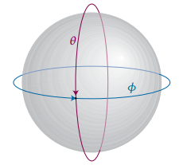

# Particle on a Sphere

The next system that will be discussed is a particle on a sphere of constant radius $$r$$, where the particle is free to move anywhere on its surface:
The wave function $$\psi$$ is with respect to $$\theta$$ and $$\phi$$, defined below:

### Defining Schrodinger's Equation for a particle on a sphere
Because the particle is constrained on the surface of the sphere, the potential energy is taken to be zero on the surface and is infinite everywhere else. Thus, because $$V=0$$, the Schrodinger equation for this system is

$$\frac{-\hbar^2}{2m}\nabla^2\psi = E\psi$$

where $$\nabla^2$$ is the laplacian operator for spherical coordinates, defined as follows:

$$\nabla^2 =\frac{1}{r} \frac{\partial^2}{\partial r^2}r + \frac{1}{r^2}\Lambda^2$$

where $$\Lambda^2$$, also called the legendarian, is

$$\Lambda^2 = \frac{1}{\sin^2\theta}\frac{\partial^2}{\partial\phi^2} + \frac{1}{\sin\theta}\frac{\partial}{\partial\theta}\left(\sin\theta\frac{\partial}{\partial\theta}\right)$$

However, because the system is constant with respect to radius $$r$$, the laplacian simplifies to $$\nabla^2 =\frac{1}{r^2}\Lambda^2$$. Thus the Schrodinger Equation becomes

$$\frac{-\hbar^2}{2m}\frac{1}{r^2}\Lambda\psi(\theta, \phi) = E\psi(\theta, \phi)$$

Finally, the moment of inertia $$I$$ (defined as $$I = 2mr^2$$) can be subsituted to obtain the final form of the Schrodinger's Equation for a particle on a sphere with constant radius:

$$\frac{-\hbar^2}{2I}\Lambda^2\psi(\theta, \phi) = E\psi(\theta, \phi)$$

### The solutions to Schrodinger's Equation: Spherical Harmonics

There are two boundary conditions that must be imposed for this model, and they must be true for every value of $$\theta$$ and $$\phi$$:

$$\psi(\theta, \phi) = \psi(\theta + 2\pi, \phi)$$

$$\psi(\theta, \phi) = \psi(\theta, \phi + 2\pi)$$

These boundary conditions ensure that after one full rotation ($$2\pi$$), the function "meets" at the same place it started, ensuring its continuity.

Thus, because these boundary conditions force spherical symmetry onto the solutions of Schrodinger's equation, the solutions can be determined through the usage of mathematical functions called spherical harmonics, denoted as $$Y_{l, m_l}(\theta, \phi)$$. For a particle confined to the surface of a sphere, these functions will also serva as the complete solution to Schrodinger's equation. $$Y_{l, m_l}(\theta, \phi)$$ satisfies the following equation:

$$\Lambda^2Y_{l, m_l}(\theta, \phi) = -l(l+1)Y_{l, m_l}(\theta, \phi)$$

where $$l = 0, 1, 2, ...$$ and $$m_l = 0, ±1, ..., ±l$$. You may recognize $$l$$ as the azimuthal quantum number (which describes the atomic orbital shape) and $$m_l$$ as the magnetic quantum number (which determines the atomic orbital orientation).

The solutions $$Y_{l, m_l}(\theta, \phi)$$ for different values of $$l$$ and $$m_l$$ are shown on the table below:

### Energies of the solutions

To determine the energies of the solutions, let's first place our solution function, $$Y_{l, m_l}(\theta, \phi)$$ into the Schrodinger equation:

$$\frac{-\hbar^2}{2I}\Lambda^2Y_{l, m_l}(\theta, \phi) = E\Y_{l, m_l}(\theta, \phi)$$

From $$\Lambda^2Y_{l, m_l}(\theta, \phi) = -l(l+1)Y_{l, m_l}(\theta, \phi)$$, we can substitute $$\Lambda^2Y_{l, m_l}(\theta, \phi)$$ as follows:

$$\frac{-\hbar^2}{2I}\Lambda^2Y_{l, m_l}(\theta, \phi) = \frac{\hbar^2}{2I}l(l+1)Y_{l, m_l}(\theta, \phi)$$

Thus, the energies $$E$$ for each solution $$Y_{l, m_l}(\theta, \phi)$$ are

$$E = \frac{\hbar^2}{2I}l(l+1)$$

Because $$l$$ has discrete values, $$E$$ is quantized. Another observation is that $$m_l$$ is absent, meaning the energy is completely independent of the direction of the motion.
