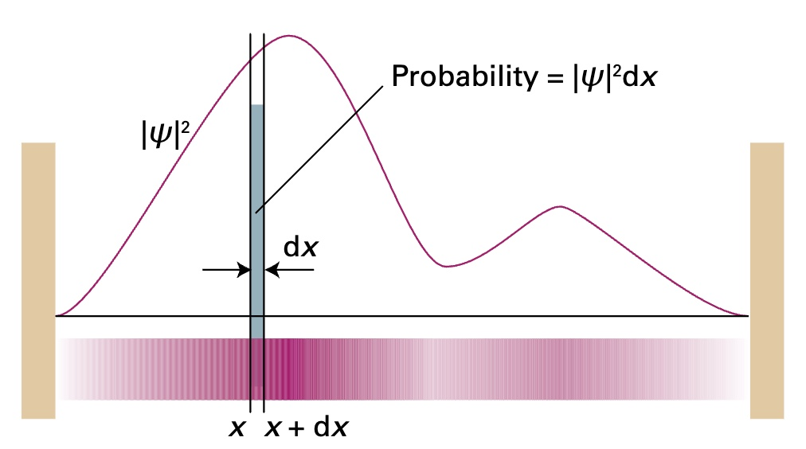

# Radial Distribution Function
The **radial distribution function** allows us to determine the distance from the nucleus an electron is most likely to be found. To derive this function, we want to consider **two components**: 
1. The [probability density](#probability-density) for a particle with wavefunction $$\psi$$ 
2. The [volume](#volume-of-a-spherical-shell) of the space a particle (in this case an electron) is allowed to occupy.

## Probability Density
For a fixed radius, the location of a particle is contained in the wavefunction. Max Born[^1] interpreted the wavefunction in a way that allows us to measure the probability of finding a photon within a region.
> **Born Interpretation**[^2] \
> If the wavefunction of a particle has the value $$\psi$$ at $$x$$, then the probability of finding the particle between $$x$$ and $$x+dx$$ is proportional to $$\vert \psi \vert ^2dx$$ \
> 

[Image Source](#fn:2){: .btn .image-caption .image-source-button } 

If we vary the radius $$r$$, the probability density becomes a function of the radius.

$$probability \ density = \vert \psi (r) \vert ^2$$

## Volume of a Spherical Shell
For any given distance $$r$$ from the nucleus, an electron can be located anywhere in the spherical volume surrounding the nucleus with radius $$r$$. To formula for this volume is simply the formula for a volume of a sphere.

$$volume = 4 \pi r^2$$

## Radial Distribution Function for an s orbital
For a single s orbital, the probability that an electron is found somewhere between the inner and outer surfaces of a spherical shell surrounding the nucleus with radius $$r$$ can be found by multiplying the probability density and the volume of the shell. Thus we have

$$P(r) = \vert \psi (r) \vert ^2 \times 4 \pi r^2$$

## General Form of $$P(r)$$
Consider locating an electron in a generic volume element 

$$d \tau = (r^2)dr \cdot (sin \theta) d\theta \ d\phi$$

Let the generic wave function for this electron be $$\psi = RY$$. Then the probability of finding an electron within this generic volume element can be written as

$$probability \ density = \vert RY \vert ^2 d\tau$$

If we want to find the total probability of finding the electron at any angle in a shell of radius $$r$$ and thickness $$dr$$, we integrate the probability density over the entire surface of the shell. Thus we get

$$P(r)dr = \int_0^{\pi} \int_0^{2\pi} R(r)^2 \vert Y_{l,m_l} \vert ^2 r^2 dr \ sin(\theta) d\theta d\phi$$

Since spherical harmonics are normalized to 1, the final generic radial distribution function is

$$P(r) = r^2 R(r)^2$$

---

[^1]: [Max Born](https://en.wikipedia.org/wiki/Max_Born)
[^2]: Atkins, P. W., De Paula, J., & Keeler, J. (2018). Atkins' Physical Chemistry (illustrated ed.), *7B.2: The Born interpretation* (pg. 247). Oxford University Press.
