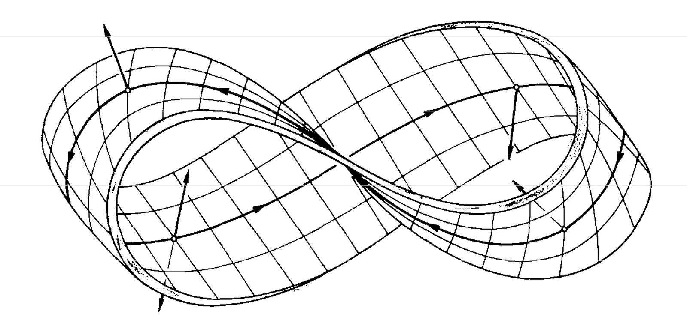
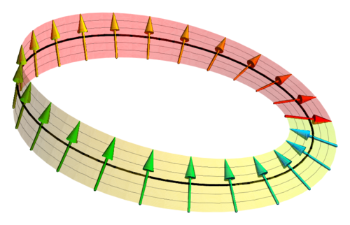

# Particle on a Möbius Strip
From our discussion of a particle on a ring[^1], we get the following definition of our wave function in terms of a quantum number $$m_l$$ and phase $$\phi$$ in radians

$$\psi = e^{im_{l}\phi}$$

The wave function must equal itself after travelling once around the ring. Thus we get that the wave function must equal itself when we add $$2\pi$$, or the travel distance around the ring in radians

$$\psi(\phi) = \psi(\phi+2\pi)$$

A Möbius strip is much like a ring in that one full pass around the Möbius strip would result in the particle starting and ending in the same location. The main difference between a Möbius strip and a ring is that the particle would need to travel twice the distance of that in a ring when it is on a Möbius strip for the particle to return to the exact same location on the same side of the Möbius strip. This is because for a particle to travel the full distance of the Möbius strip, it must travel along both sides of the Möbius strip.

Source[^2]
{: .hidden }

[Image Source](#fn:2){: .btn .image-caption .image-source-button } \
This means that the wave function must equal itself when we add $$4\pi$$ rather than $$2\pi$$ as seen in the particle on a ring.

$$\psi(\phi) = \psi(\phi+4\pi)$$

We can use this relationship to find the conditions for our quantum number $$m_l$$ by plugging in our definition for the wave function $$\psi$$

$$\begin{align}
& e^{im_l\phi} & = e^{im_l(\phi+4\pi)} \\
\implies & 1 & = e^{4\pi i m_l} & = {\left( e^{i\pi} \right)}^{4m_l} \\
& 1 & = {(-1)}^{4m_l}
\end{align}$$

For the above statement to hold true, $$4m_l$$ must always equal an even whole number, thus $$m_l$$ can only be multiples of $$\frac{1}{2}$$

$$m_{l} = \ldots ,\frac{-3}{2},-1,\frac{-1}{2},0,\frac{1}{2},1,\frac{3}{2},\ldots$$

## Why Discuss a Particle on a Möbius Strip?
The quantum numbers $$m_l$$ described above are unusual in the context of introductory quantum mechanics. However, this quantization is directly related to the concept of **spinors**

> ### What are Spinors?
> In quantum mechanics, the wave function describes a particle's state. When we rotate a classical object by $$360^{/circ}$$, it returns to its original configuration - one would expect the same to happen to a quantum particle.
>
> **Spinors**, on the other hand, require a rotation of $$720^{\circ}$$, two full rotations, to return to its original state. The wave function described above returns to its original state at $$4 \pi$$, or two full rotations, making this wave function a **spinor**. 

### Spinors in Physical Chemistry
The property of requiring two full rotations to return to its original state is a core characteristic of fermions (electrons, protons, neutrons). This leads to the property of **electron spin**, a purely quantum mechanical angular momentum with no classical equivalent. 

The electron's spin quantum number, $$m_s$$, can only take on values of $$+ \frac{1}{2}$$ or $$- \frac{1}{2}$$, which is a direct consequence of the electron being a spinor.

 

Source[^3]
{: .hidden }

[Image Source](#fn:3){: .btn .image-caption } \
The **Pauli Exclusion Principle**, which states no two electrons can occupy the same quantum state, is built upon the electron's spin. This principle is responsible for the periodic table's structure, the nature of chemical bonds, and the stability of matter itself.

By studying a particle on a Möbius strip, you are exploring the mathematical properties of a spinor in a simple, tangible model. This simple model provides a physical basis for understanding why electrons have half-integer spin, a concept that is critical to understanding atomic molecular structure, spectroscopy, and magnetism.

---

[^1]: [Particle on a Ring](http://localhost:4000/Particle-In-A-Ring.html)
[^2]: [Möbius Strip Image](https://medium.com/@shengmorni/1963-88a359d2f68b)
[^3]: [Spinor Image](https://en.wikipedia.org/wiki/Spinor#cite_note-1)
