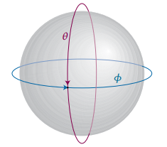

# Particle on a Sphere

The next system that will be discussed is a particle on a sphere of constant radius $$r$$, where the particle is free to move anywhere on its surface:

$$\theta$$ in spherical coordinates is similar to that in the particle on a ring, but \$$phi$$ is introduced as a third dimension, and is the angle from the positive z-axis
### Defining Schrodinger's Equation for a particle on a sphere
Because the particle is constrained on the surface of the sphere, the potential energy is taken to be zero on the surface and is infinite everywhere else. Thus, because $$V=0$$, the Schrodinger equation for this system is

$$\frac{-\hbar^2}{2m}\nabla^2\psi = E\psi$$

where $$\nabla^2$$ is the laplacian operator for spherical coordinates, defined as follows:

$$\nabla^2 =\frac{1}{r} \frac{\partial^2}{\partial r^2}r + \frac{1}{r^2}\Lambda^2$$

where $$\Lambda^2$$, also called the legendarian, is

$$\Lambda^2 = \frac{1}{\sin^2\theta}\frac{\partial^2}{\partial\phi^2} + \frac{1}{\sin\theta}\frac{\partial}{\partial\theta}\left(\sin\theta\frac{\partial}{\partial\theta}\right)$$

However, because the system is constant with respect to radius $$r$$, the laplacian simplifies to $$\nabla^2 =\frac{1}{r^2}\Lambda^2$$. Thus the Schrodinger Equation becomes

$$\frac{-\hbar^2}{2m}\frac{1}{r^2}\Lambda\psi(\theta, \phi) = E\psi(\theta, \phi)$$

Finally, the moment of inertia $$I$$ (defined as $$I = 2mr^2$$) can be subsituted to obtain the final form of the Schrodinger's Equation for a particle on a sphere with constant radius:

$$\frac{-\hbar^2}{I}\Lambda^2\psi(\theta, \phi) = E\psi(\theta, \phi)$$

### The solutions to Schrodinger's Equation
Show fig 7f.5 to demonstrate what the solutions look like

